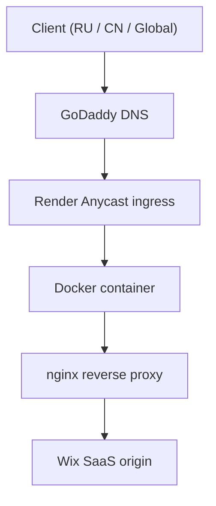

# www.ters-team.com - Network Infrastructure Engineering

Репозиторий проекта по обеспечению доступности, стабильности и безопасности сайта научной группы **www.ters-team.com** при доступе из разных регионов (США/Европа, РФ и КНР) с использованием Ingress, reverse proxy, Anycast и CDN/edge-подходов.

⚠️ **Контекст**

Проект возник не как задача «ускорить сайт», а как инженерная попытка обеспечить **стабильный доступ к одному и тому же SaaS (Wix)** из регионов с радикально разной сетевой и политической реальностью: **США/Европа, РФ и материковый Китай**. Большинство стандартных CDN/edge-решений (Cloudflare, Netlify, Gcore) показали **частичную или полную недоступность** в одном из регионов.


## Навигация
- [Цели](#цели)
- [Success criteria](#success-criteria)
- [Ключевые шаги](#ключевые-шаги-коротко)
- [Архитектура (итоговая)](#архитектура-итоговая)
- [Resource & Cost Constraints](#resource--cost-constraints)
- [Почему не Cloudflare как управляемый CDN/edge-провайдер](#почему-не-cloudflare-как-управляемый-cdnedge-провайдер)
- [Основные принципы:](#основные-принципы)
- [Структура репозитория](#репозиторий-как-устроен)
- [Быстрый старт](#быстрый-старт-локально)
- [Тонкости reverse proxy](#тонкости-reverse-proxy)
- [Testing methodology](#testing-methodology)
- [Observability](#observability)
- [Следующие шаги](#следующие-шаги)
- [Известные ограничения](#известные-ограничения)


## Цели
- Обеспечить предсказуемую доступность SaaS-origin (Wix) в сетевых средах с DPI-фильтрацией (РФ, Материковый Китай).
- Минимизировать влияние:
  - DNS poisoning,
  - TCP degradation,
  - TLS handshake instability
  на успешный first-load (TTFB).
- Сохранить корректную работу:
  - TLS (SNI-based routing),
  - canonical redirects,
  - SPA runtime (JS/CSS),
  - SEO (единый origin-домен).
- Исключить зависимость от managed CDN routing logic
  в пользу детерминированной L7 маршрутизации.
- Подготовить ingress-инфраструктуру для:
  - контейнеризации (Docker),
  - CI/CD деплоя,
  - SRE (SLO/SLA),
  - synthetic latency monitoring.
  - synthetic readiness probing (RU/CN vantage points)


## Success criteria
- Successful first-load from RU and CN networks without VPN.
- TLS handshake success rate > 99%.
- First byte latency (TTFB) < 4s in mainland China.
- No upstream TLS/SNI mismatch errors.
- Deterministic routing path (no GeoDNS / edge decision logic).


## Ключевые шаги

**Phase 1 - Platform**
- Google - Wix migration
- RU-zone - TR-zone (account continuity workaround)

**Phase 2 - Managed edge experiments**
- Cloudflare DNS + тесты RU/CN - временное решение
- Cloudflare Tunnel (http2/IPv4)
- Netlify iframe mirror (RU) - временное решение
- Netlify DNS + Edge Functions (отказ из-за GFW)

**Phase 3 - Deterministic ingress**
- FRP как transport PoC
- VPS (Kamatera) - выявление single-region routing limits
- Render (PaaS Anycast) - финальный production ingress

### Основной вывод
Данная работа не является CDN-задачей, а задачей обеспечения доставки SaaS-контента (Wix) и грамотной инженерией Ingress-уровня в условиях нестабильной сетевой маршрутизации и DPI-фильтрации.

**Решение найдено не через дополнительный CDN-слой, а через:**
- контроль L7,
- отказ от QUIC,
- отказ от Cloudflare **как управляемого edge/CDN слоя**
- сохранение Anycast-доступности через облачные PaaS-провайдеры (Render)
- точную настройку reverse-proxy,
- отработку SRE-подходов,
- мониторинг SLA/SLO/latency,
- минимализм и предсказуемость.


## Архитектура (итоговая)

**Примечание:** Anycast используется на уровне PaaS-провайдера (Render), а не как управляемый CDN с логикой маршрутизации.


## Readiness & Deployment Safety Model
Ingress-прокси реализует двухуровневую проверку доступности (liveliness/readiness):

`/healthz` - проверяет только liveliness ingress (nginx container running)  
`/readyz`  - проверяет доступность upstream SaaS-origin (Wix)

Деплой контролируется через `/healthz`, а доступность upstream SaaS-origin проверяется через `/readyz` после деплоя.

### `/healthz`
Возвращает `200 OK`, если:
- контейнер nginx запущен,
- конфигурация загружена,
- ingress готов принимать соединения.
**Не выполняет upstream-проверок.**

Используется для:
- container runtime liveliness checks,
- Render service health.

### `/readyz`
Выполняет **реальный HTTP GET-запрос к upstream Wix-origin** через internal proxy:

```nginx
auth_request /_readyz_upstream;
```
- Деплой считается подтвержденным, если:
  - upstream TLS handshake успешен,
  - upstream TCP connection устанавливается,
  - upstream HTTP endpoint отвечает 2xx или 3xx.

**Любая upstream-ошибка (HTTP 4xx/5xx, timeout, connection failure или TLS handshake failure) приводит к состоянию: HTTP 503 upstream not ready**

Upstream-check выполняется с тем же Host/SNI, что и пользовательский трафик - это позволяет выявлять ошибки Wix multi-tenant routing, TLS SNI mismatch или origin canonical mapping. Таким образом CI/CD pipeline проверяет не только liveliness ingress, но и фактическую способность reverse-proxy обслужить пользовательский трафик.


## Resource & Cost Constraints
Ingress-инфраструктура была спроектирована для достижения предсказуемой доступности SaaS-origin в сетевых средах с DPI-фильтрацией с учётом минимизации операционных расходов при текущей рабочей нагрузке (baseline workload).

Таким образом ingress-архитектура:

- обеспечивает предсказуемый first-load,
- стабильный TLS handshake,
- доступность из РФ (включая мобильных провайдеров), КНР, Европы, США, Азии, Южной Америки, Австралии.

**Без использования GeoDNS или multi-region CDN, при минимальной стоимости и предсказуемом пути масштабирования.**

### Что сознательно не использовалось
- Geo-DNS
- country-based routing
- multiple entrypoints (ru/cn зеркала)
- HTTP/3 / QUIC
- JavaScript challenges
- CAPTCHA/bot mitigation
- SaaS-level rewrite/iframe embedding

**Причина:** каждый из этих механизмов увеличивает вероятность дрейфа состояния и поведения под GFW в КНР и у сетевых провайдеров в РФ.


## Почему НЕ Cloudflare как управляемый CDN/edge-провайдер
Cloudflare и аналогичные CDN (Gcore/Netlify) **не решают** эту задачу по следующим причинам:

- CDN **частично/полностью фильтруется или деградирует у сетевых провайдеров РФ (особенно у мобильных операторов)**
- QUIC/HTTP/3/IPv6 нестабильны в мобильных сетях РФ и под GFW
- Cloudflare абстрагирует часть L4/L7 поведения и усложняет детерминированную диагностику (handshake/route/edge selection)
- невозможно детерминированно управлять routing path и TLS handshake поведением

### Примечание о Cloudflare
Хотя итоговая инфраструктура физически МОЖЕТ использовать транзитные узлы Cloudflare, такие как CF-ray (через Anycast систему PaaS-провайдера Render), Cloudflare **НЕ участвует в управлении трафиком**:

- DNS не делегирован Cloudflare
- proxy / rules / workers не используются
- QUIC не является обязательным транспортом

Таким образом Cloudflare выступает исключительно как транзитный edge-провайдер, а не как архитектурный компонент системы.


## Основные принципы:
- один публичный entrypoint
- отказ от DNS-level плясок
- детерминированная L7 маршрутизация
- минимальное вмешательство в SaaS-логику (Wix)
- liveness-gated (перед деплоем) и readiness-validated deployments (проверка доступности после деплоя)

Принятые решения: см. `docs/decisions.md`  
Отладка/ошибки: см. `docs/troubleshooting.md`  
Дорожная карта: см. `docs/roadmap_issues.md`  
Скриншоты настроек, логов, ошибок: см. `docs/screenshots`


## Репозиторий: как устроен
```
cdn/                    # Конфиги/заметки/cкриншоты по Cloudflare DNS/Tunnel и Netlify Iframe mirror/Edge Functions
docs/                   # Decisions, Roadmap, Runbook, Postmortem, Synthetic probes, SLO/SLA, Screenshots
.github/                # Конфиг для GitHub Actions CI/CD
monitoring/             # Настройка метрик
cloud/                  # Используемые облачные сервисы (Kamatera/Render) и Dockerfile/compose/конфиги nginx
frp-server/             # Fast Reverse Proxy конфиги
```


## Быстрый старт (локально)
1. Установить Docker и Docker Compose.
2. Поместить свой финальный `nginx.conf` в `docker/nginx/nginx.conf`.
3. Убедиться, что nginx слушает нужный порт (`$PORT` для Render или `8080` локально).
4. Проверить `docker/docker-compose.yml` (порт публикации, имя сервиса, сеть).
5. Запуск:
   ```bash
   docker compose up -d
   curl -I http://localhost:8080
   ```
   Ожидается `HTTP/1.1 200 OK`.
6. Если используется Render - порт задаётся через переменную окружения `PORT`.


## Тонкости reverse proxy
- **IPv6**: upstream может резолвиться в AAAA - при отсутствии IPv6-маршрутизации используем `resolver ... ipv6=off;`.
- **SNI**: для TLS к upstream включить `proxy_ssl_server_name on;`.
- **Host-заголовок**: `proxy_set_header Host <upstream_host>;`.
- **sub_filter**: подмена абсолютных ссылок на нужный origin (см. пример в `nginx.conf`).
- **Accept-Encoding**: для корректной подмены HTML/CSS/JS отключаем gzip у upstream: `proxy_set_header Accept-Encoding "";`.
- **HTTP/2**: используется между клиентом и proxy (если доступно); upstream к Wix - HTTP/1.1 для совместимости.
- **Редиректы**: канонизация (`www`) выполняется на proxy для предсказуемости. В регионах с высоким RTT (КНР) возможна минимальная доп. задержка - допустимый компромисс.


## Testing methodology
### Как измерялась доступность
- curl (TTFB / connect / redirect timing)
- dig / nslookup (NS, IP)

### Synthetic probes (RU/CN vantage points)
**China accessibility tools:**
- ITDog
- AppInChina tester
- Blocky GreatFire
- WebSitePulse
**Russia accessibility tools:**
- 2ip
- ping-admin
**Worldwide accessibility tools:**
- Check Host
- Globalping
- DNS Checker

### ISP-level tests:
- Rostelecom
- Tomica
- Beeline HSPA+/LTE+
- MTS HSPA+/LTE+
- Browser waterfall analysis
- nginx upstream timing logs

Целью являлось **достижение предсказуемого first-load (без TLS handshake failure и TCP stall) в сетевых средах с DPI-фильтрацией.**


## Observability
### Current observability stack:
- nginx access logs
- upstream timing metrics
- synthetic probes (RU/CN)
- Grafana / Loki (planned)

### Key signals monitored:
- upstream_connect_time
- upstream_header_time
- TLS handshake failures
- HTTP 5xx rate


## Следующие шаги
- SRE (latency tests, SLO, SLA)
- Monitoring (Loki/Grafana cloud)


## Известные ограничения
- Media CDN Wix (media.wixstatic.com, static.wixstatic.com) частично фильтруется провайдерами РФ:
  - Основной SPA runtime (JS/CSS/fonts) загружается корректно;
  - Статические изображения требуют proxy-pass или альтернативного CDN;

- TLS 1.3 / QUIC / HTTP/3 сознательно не используются:
  - UDP-based transport нестабилен в мобильных сетях РФ.
  - QUIC подвержен DPI-фильтрации под GFW.
  - IPv6 routing в регионах с фильтрацией может увеличивать TLS handshake latency или приводить к upstream connection failure.

- HTTP/2 используется только между клиентом и ingress-proxy:
  - Upstream к Wix остаётся HTTP/1.1 для совместимости с multi-tenant SaaS runtime.

- Дополнительные redirect RTT (HTTP-HTTPS, root-www) увеличивают latency в регионах с высоким RTT (КНР):
  - Сознательно сохраняются для SEO-consistency.


## Лицензия
MIT.

---

### Этот репозиторий - пример того, как **сетевые и политические ограничения** напрямую влияют на архитектуру веб-систем.
### Здесь нет «серебряной пули», только инженерные компромиссы.
