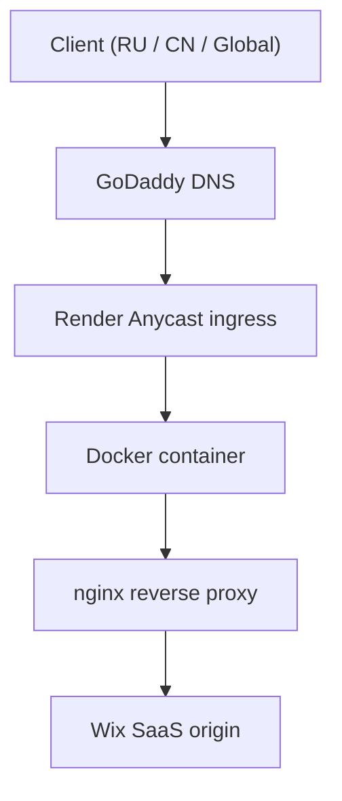

# www.ters-team.com - Network Infrastructure Engineering

A project repository focused on ensuring the availability, stability, and security of the **www.ters-team.com** research group website when accessed from different regions, including the United States / Europe / Asia, Russia, and mainland China, using ingress, reverse proxy, Anycast, and CDN / edge approaches.

⚠️ **Context**

This project did not begin as an attempt to simply "speed up a website." It emerged as an engineering effort to provide **stable access to the same SaaS platform (Wix)** from regions with radically different network and political realities: **the United States / Europe / Asia, Russia, and mainland China**. Most standard CDN / edge solutions such as Cloudflare, Netlify, and Gcore showed **partial or complete inaccessibility** in at least one of these regions.


## Navigation
- [Goals](#goals)
- [Success criteria](#success-criteria)
- [Key phases](#key-phases)
- [Final architecture](#final-architecture)
- [Deployment and service readiness model](#deployment-and-service-readiness-model)
- [Resources and cost](#resources-and-cost)
- [Why not Cloudflare as a managed CDN / edge provider](#why-not-cloudflare-as-a-managed-cdn--edge-provider)
- [Core principles](#core-principles)
- [Repository structure](#repository-structure)
- [Quick start](#quick-start-local)
- [Reverse proxy details](#reverse-proxy-details)
- [Testing methodology](#testing-methodology)
- [Observability](#observability)
- [Next steps](#next-steps)
- [Known limitations](#known-limitations)


## Goals
- Ensure predictable availability of the SaaS origin (Wix) in DPI-filtered network environments such as Russia and mainland China.
- Minimize the impact of:
  - DNS poisoning
  - TCP degradation
  - TLS handshake instability  
  on successful first load and TTFB.
- Preserve correct behavior for:
  - TLS (SNI-based routing)
  - canonical redirects
  - SPA runtime (JS/CSS)
  - SEO (single canonical origin domain)
- Eliminate dependence on managed CDN routing logic in favor of deterministic L4 / L7 routing.
- Prepare the ingress infrastructure for:
  - containerization (Docker)
  - CI/CD deployment
  - SRE practices (SLO / SLA)
  - traffic monitoring
  - synthetic tests from multiple vantage points (EU / USA / Asia / RU / CN)


## Success criteria
- successful first load from Russian and Chinese networks without using a VPN
- TLS handshake success rate above 99%
- first byte latency (TTFB) below 4 seconds in mainland China
- no upstream TLS / SNI mismatch errors
- deterministic traffic path with no GeoDNS or edge decision logic


## Key phases

### Phase 1 — Platform
- Google → Wix migration
- basic website configuration (DNS, SEO, canonical settings, title, favicon)

### Phase 2 — Managed edge experiments
- Cloudflare DNS + RU / CN testing as a temporary solution
- Cloudflare Tunnel (HTTP/2 over IPv4)
- Netlify iframe mirror for Russia as a temporary solution
- Netlify DNS + Edge Functions, later rejected due to GFW-related issues

### Phase 3 — Deterministic ingress
- FRP as a transport-layer PoC
- VPS (Kamatera) to identify single-region routing limitations
- Render (PaaS Anycast) as the final production ingress
- monitoring, SRE, SLO / SLA, and synthetic testing

### Main conclusion
This work is not fundamentally a CDN problem. It is a problem of delivering SaaS content (Wix) through well-engineered ingress architecture under unstable network routing and DPI filtering conditions.

The solution was found not through an additional CDN layer, but through:
- L4 and L7 control
- eliminating QUIC
- rejecting Cloudflare **as a managed edge / CDN layer**
- retaining Anycast reachability through a cloud PaaS provider (Render)
- precise reverse proxy configuration
- an SRE-oriented approach
- monitoring for SLA / SLO / latency / synthetic tests
- minimalism and predictability


## Final architecture


**Note:** Anycast is used at the PaaS provider layer (Render), not as a managed CDN with routing logic.


## Deployment and service readiness model
The ingress proxy implements a two-level availability model: liveliness and readiness.

`/healthz` checks only ingress liveliness (`nginx` container running)  
`/readyz` verifies actual availability of the upstream SaaS origin (Wix)

Deployment is controlled through `/healthz`, while upstream availability is validated through `/readyz` after deployment.

### `/healthz`
Returns `200 OK` if:
- the nginx container is running
- the configuration is loaded
- the ingress is ready to accept connections

**It does not perform any upstream checks.**

Used for:
- container runtime liveliness checks
- Render service health

### `/readyz`
Performs a **real HTTP GET request to the upstream Wix origin** via an internal proxy:
```
auth_request /_readyz_upstream;
```

A deployment is considered confirmed only if:
- the upstream TLS handshake succeeds
- the upstream TCP connection is established
- the upstream HTTP endpoint returns `2xx` or `3xx`

**Any upstream error** (`4xx` / `5xx`, timeout, connection failure, or TLS handshake failure) results in: `HTTP 503 upstream not ready`

The upstream check uses the same Host / SNI values as real user traffic, allowing detection of Wix multi-tenant routing issues, TLS SNI mismatches, and origin canonical mapping problems. This means the CI/CD pipeline validates not only ingress liveliness, but the actual ability of the reverse proxy to serve user traffic.


## Resources and cost
The ingress infrastructure was designed to achieve predictable SaaS-origin availability in DPI-filtered network environments while minimizing operational cost at the current baseline workload.

As a result, the architecture provides:
- predictable first load
- stable TLS handshake
- accessibility from Russia, including mobile providers
- accessibility from mainland China, Europe, the United States, Asia, South America, and Australia

**All of this without GeoDNS or a multi-region CDN, while maintaining low cost and a predictable scaling path.**

### What was intentionally not used
- GeoDNS
- country-based routing
- multiple entry points (`ru` / `cn` mirrors)
- HTTP/3 / QUIC
- JavaScript challenges
- CAPTCHA / bot mitigation
- SaaS-level rewrite or iframe embedding

**Reason:** each of these mechanisms increases the probability of state drift and unpredictable behavior under the Great Firewall and Russian ISP filtering environments.


## Why not Cloudflare as a managed CDN / edge provider
Cloudflare and similar CDNs such as Gcore and Netlify **do not solve** this problem for several reasons:
- CDN infrastructure is partially or fully filtered or degraded by Russian ISPs, especially mobile providers
- QUIC / HTTP/3 / IPv6 are unstable in Russian mobile networks and under the Great Firewall
- Cloudflare abstracts part of the L4 / L7 behavior and makes deterministic diagnosis of handshake, routing, and edge selection more difficult
- it does not provide deterministic control over the routing path and TLS handshake behavior

### Note on Cloudflare
Although the final infrastructure may physically transit through Cloudflare nodes such as `CF-ray` as part of Render's Anycast system, Cloudflare **does not participate in traffic control**:
- DNS is not delegated to Cloudflare
- proxy rules, Workers, and Cloudflare-managed logic are not used
- QUIC is not required as a transport

Therefore, Cloudflare acts only as a possible transit edge provider, not as an architectural component of the system.


## Core principles
- one public entry point
- no DNS-level routing tricks
- deterministic L4 / L7 routing
- minimal interference with SaaS logic (Wix)
- liveliness-gated deployments and readiness-validated post-deploy checks

Implemented decisions: see `docs/adr.md`  
Troubleshooting: see `docs/runbooks`  
Incident history: see `docs/postmortems`  
Availability / inaccessibility reports: see `docs/reports`  
Current website state: `docs/current-state`  
Roadmap: see `docs/roadmap.md`  
Screenshots of settings, logs, and failures: see `docs/screenshots`


## Repository structure
```
cdn/                    # configs, notes, and screenshots for Cloudflare DNS/Tunnel and Netlify iframe mirror / Edge Functions
docs/                   # decisions, roadmap, runbooks, postmortems, synthetic probes, SLO/SLA, screenshots
.github/                # GitHub Actions CI/CD configuration
monitoring/             # dashboards (Grafana Cloud JSON)
cloud/                  # cloud services used (Kamatera / Render) and Dockerfile / compose / nginx configs
frp-server/             # Fast Reverse Proxy configs
```


## Quick start (local)
1. Install Docker and Docker Compose.
2. Place your final `nginx.conf` into `docker/nginx/nginx.conf`.
3. Ensure nginx listens on the correct port (`$PORT` for Render or `8080` locally).
4. Check `docker/docker-compose.yml` for published ports, service name, and network settings.
5. Start the stack:
```
docker compose up -d
curl -I http://localhost:8080
```
Expected result: `HTTP/1.1 200 OK`
6. When using Render, the port is provided through the `PORT` environment variable.


## Reverse proxy details
- **IPv6:** the upstream may resolve to AAAA records; when IPv6 routing is unavailable, use `resolver ... ipv6=off;`
- **SNI:** enable `proxy_ssl_server_name on;` for upstream TLS
- **Host header:** use `proxy_set_header Host <upstream_host>;`
- **sub_filter:** rewrite absolute links to the required origin as needed
- **Accept-Encoding:** disable upstream gzip for HTML/CSS/JS rewriting with `proxy_set_header Accept-Encoding "";`
- **HTTP/2:** used between client and proxy where available; upstream to Wix remains HTTP/1.1 for compatibility
- **Redirects:** canonicalization to `www` is handled at the proxy for predictability. In high-RTT regions such as mainland China, this introduces a small but acceptable latency trade-off.


## Testing methodology

### How availability was measured
- `curl` for TTFB, connect, and redirect timing
- `dig` / `nslookup` for NS and IP diagnostics

### Availability testing tools (RU / CN)

**Mainland China:**
- ITDog
- AppInChina tester
- Blocky GreatFire
- WebSitePulse

**Russia:**
- 2ip
- ping-admin

**Rest of the world:**
- Check Host
- Globalping
- DNS Checker

### Local ISP-level tests
- Rostelecom
- Beeline (Vimpelcom)
- Megafon
- MTS
- browser waterfall analysis
- nginx upstream timing logs


## Observability

### Current monitoring stack
- nginx logs
- Grafana / Loki
- SLO / SLA
- full traffic passing through the ingress node (bots, agents, real users, and so on)
- real user traffic
- upstream latency
- request geography
- synthetic tests


## Next steps
- continue improving SRE practices
- expand monitoring and reporting depth
- refine SLO / SLA tracking and synthetic observability


## Known limitations
- Wix media CDN domains such as `media.wixstatic.com` and `static.wixstatic.com` are partially filtered by some Russian providers:
  - the main SPA runtime (JS/CSS/fonts) loads correctly
  - static images may in some cases require proxying

- QUIC / HTTP/3 are intentionally not used:
  - UDP-based transport is unstable in Russian mobile networks
  - QUIC is vulnerable to DPI filtering under the Great Firewall
  - IPv6 routing in filtered regions may increase TLS handshake latency or cause upstream connection failures

- HTTP/2 is used only between the client and the ingress proxy:
  - upstream traffic to Wix remains HTTP/1.1 for compatibility with the multi-tenant SaaS runtime

- Additional redirect RTTs such as HTTP→HTTPS and root→`www` increase latency in high-RTT regions such as mainland China:
  - these are intentionally preserved for SEO consistency


## License
see LICENSE.

---

### This repository is an example of how **network and political constraints** directly affects web system architecture.
### There is no universal solution, only engineering trade-offs.
