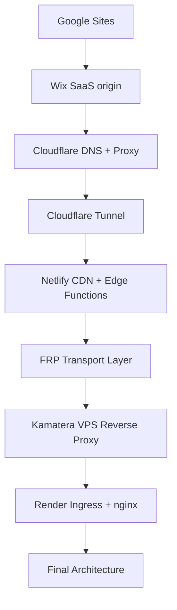

# Architecture Decision Records (ADR)

This document tracks architectural decisions made during the development of the ingress infrastructure for **www.ters-team.com**.

The goal of the project is to ensure **stable global accessibility of a SaaS-origin website (Wix)** from regions with complex network environments, including:
- Europe / United States
- Russian ISP networks
- mainland China (GFW)

Each record documents:
- decision
- motivation
- alternatives considered
- status

Format:
```
ADR-XXX — Title

Decision
Reason
Alternatives
Status
```

## Architecture evolution


Final production architecture:
```
Client
↓
GoDaddy DNS
↓
Render ingress
↓
Docker container
↓
nginx reverse proxy
↓
Wix SaaS origin
```

# Decision Log

## ADR-001 — Migration from Google Sites to Wix
### Decision
Migrate the website and DNS management to the Wix platform.
### Reason
Google services are partially filtered under the Great Firewall in mainland China, causing unreliable accessibility.
### Alternatives
- remain on Google infrastructure  
- migrate to another China-friendly platform (limited functionality / higher price $)
### Status
✅ Implemented


## ADR-002 — Migration from Russian Wix region to Turkish region
### Decision
Move the Wix account from the Russian region to the Turkish region.
### Reason
Wix discontinued support for Russian accounts, creating a risk of account suspension.
### Alternatives
- migrate to another SaaS platform  (time consuming / higher price $)
- maintain the Russian-region account (high risk)
### Status
✅ Implemented


## ADR-003 — Cloudflare as initial edge layer
### Decision
Move DNS and proxy functionality to Cloudflare and test edge routing through Cloudflare infrastructure.
### Reason
Direct Wix IP addresses (AWS/Akamai) were partially filtered in mainland China.
### Alternatives
- continue using GoDaddy DNS  
- use Wix DNS directly
### Status
⚠️ Used temporarily. Later removed due to degraded accessibility in Russian ISP networks.


## ADR-004 — Cloudflare degradation in Russian networks
### Decision
Attempt mitigation strategies including subdomain routing and regional fallback.
### Reason
Some Russian ISPs (especially mobile carriers) filter or degrade Cloudflare IP ranges.
### Alternatives
- dedicated VPS ingress  
- alternative CDN providers
### Status
⚠️ Temporary workaround. Cloudflare was later removed from the architecture.


## ADR-005 — Enforce IPv4 upstream connections
### Decision
Disable IPv6 resolution in nginx:
```
resolver ... ipv6=off;
```
Enable correct TLS routing:
```
proxy_ssl_server_name on;
```
### Reason
IPv6 upstream connections produced errors:
```
connect() failed (101: Network unreachable)
```
### Alternatives
- enable system IPv6 routing  
- tunnel IPv6 connectivity
### Status
✅ Implemented


## ADR-006 — Cloudflare Tunnel transport configuration
### Decision
Force HTTP/2 over TCP instead of QUIC:
```
cloudflared --protocol http2 --edge-ip-version 4
```
### Reason
QUIC (UDP) transport was unstable in several environments:
- mobile networks  
- WSL networking  
- filtered networks
### Alternatives
- continue using QUIC  
- configure UDP routing
### Status
⚠️ Temporary experiment


## ADR-007 — Netlify mirror via iframe
### Decision
Deploy a Netlify subdomain (`ru.ters-team.com`) embedding the Wix site via iframe.
### Reason
Provide accessibility for Russian networks affected by CDN filtering.
### Alternatives
- full reverse proxy via Netlify Edge Functions  
- VPS-based proxy
### Status
⚠️ Partial solution. Limited by iframe constraints and SEO issues.


## ADR-008 — Netlify DNS + Edge Functions reverse proxy
### Decision
Delegate DNS to Netlify and deploy an Edge Function reverse proxy.
### Reason
Maintain a unified domain entry point while proxying Wix content.
### Alternatives
- alternative CDN providers  
- VPS ingress proxy
### Status
⚠️ Experiment failed. Edge functions did not reliably proxy Wix content.


## ADR-009 — Removal of Netlify architecture
### Decision
Remove Netlify from the infrastructure.
### Reason
Netlify infrastructure was partially blocked in mainland China (RST packets and DNS poisoning).
### Alternatives
- continue using Netlify without Chinese accessibility
### Status
✅ Implemented


## ADR-010 — FRP (Fast Reverse Proxy) transport layer
### Decision
Use FRP (`frpc / frps`) as a temporary transport layer.
### Reason
Provide a quick public ingress point for experimentation without deploying a full VPS.
### Alternatives
- direct VPS reverse proxy
### Status
✅ Used as a temporary PoC.


## ADR-011 — VPS ingress on Kamatera
### Decision
Deploy an nginx reverse proxy on a Kamatera VPS (Singapore).
### Reason
Full control over:
- IPv4 / IPv6  
- TLS  
- routing
Kamatera IP ranges were not heavily filtered in Russia or China.
### Alternatives
- Hetzner (partially blocked in Russia)
- OVH  
- CDN providers with China networks
### Status
⚠️ PoC completed but high latency remained.


## ADR-012 — Render as production ingress platform
### Decision
Deploy the nginx reverse proxy in Render as a Docker container.
### Reason
Render provides:
- globally optimized routing  
- stable accessibility from Russian networks  
- improved reachability from mainland China  
- low operational overhead $
### Alternatives
- Fly.io  (limited in mainland China / higher price $)
- multi-region VPS deployment
### Status
✅ Production architecture


## ADR-013 — Domain canonicalization at ingress
### Decision
Canonicalize traffic to:
```
www.ters-team.com
```
using nginx redirects.
### Reason
Ensure consistent SEO signals and a single public entry point.
### Alternatives
- allow Wix to manage canonical redirects
### Status
✅ Implemented


## ADR-014 — Use HTTP/2 without QUIC
### Decision
Use HTTP/2 over TCP and avoid HTTP/3 / QUIC.
### Reason
QUIC (UDP transport) is frequently degraded or filtered in:
- Russian mobile networks  
- Great Firewall environments
### Alternatives
- HTTP/1.1
### Status
✅ Implemented


## ADR-015 — Liveness and readiness endpoints
### Decision
Introduce two health endpoints:
```
/healthz  - ingress liveness
/readyz   - upstream availability
```
### Reason
Basic smoke tests could pass even when the upstream SaaS origin was unavailable.
**The readiness check verifies:****
- TCP connectivity  
- TLS handshake  
- Host/SNI routing  
- HTTP response
### Alternatives
- single health endpoint  
- platform-level health checks
### Status
✅ Implemented


## ADR-016 — Tag-gated production deployment
### Decision
Deploy production only from Git tags:
```
vX.Y.Z
```
with an additional constraint:
```
tag commit must equal HEAD of main
```
### Reason
Prevents accidental deployments and ensures reproducible releases.
### Alternatives
- deploy on every push to main  
- release-triggered deployments
### Status
✅ Implemented


## ADR-017 — Gcore DNS / GeoDNS experiment
### Decision
Test Gcore DNS with dynamic routing (GeoDNS) for region-aware ingress.
### Reason
Attempt to improve accessibility from China and Russia using managed DNS routing.
### Alternatives
- GoDaddy DNS (static records), CDN-managed DNS (Cloudflare).
### Outcome
DNS resolution became unstable from mainland China (inconsistent responses / intermittent reachability).
### Resolution
Restore authoritative DNS to GoDaddy and simplify DNS architecture.
### Status
⚠️ Experiment completed, not used in production.


## ADR-018 — Avoid GeoDNS and DNS routing logic
### Decision
Do not use GeoDNS or country-based DNS responses.
### Reason
GeoDNS increases architectural complexity and can cause inconsistent resolver behavior in filtering environments.
### Alternatives
- regional DNS routing  
- country-based subdomains
### Status
✅ Implemented


## ADR-019 — Simplified DNS architecture (single ingress IP)
### Decision
Use the same ingress IP for both root and www domains:
```
www.ters-team.com  A  216.24.57.3
ters-team.com      A  216.24.57.3
```
### Reason
This simplifies DNS behavior and avoids resolver inconsistencies in networks with aggressive DNS caching.
Domain canonicalization is handled by the ingress proxy.
### Alternatives
- CNAME flattening  
- GeoDNS routing (mainland China limeted)   
- separate ingress IPs  (better to keep working IPs for the fallback)
### Status
✅ Production configuration


## ADR-020 — Minimal nginx ingress configuration
### Decision
Use a minimal nginx reverse proxy configuration and avoid complex caching or CDN-style rewriting logic.
### Reason
The SaaS origin (Wix) already provides its own CDN layer. Additional proxy complexity reduced stability during testing.
### Alternatives
- aggressive caching  
- complex asset rewriting  
- edge logic
### Status
✅ Implemented


## ADR-021 — Observability and SLO/SLA system introduction
### Decision
Introduce a multi-layer observability system based on:
```
nginx access logs - Loki (Grafana)
dashboards for traffic, geography, and SLO
separation of Edge traffic and Consumer traffic
synthetic monitoring for global availability
```
### Reason
Ingress accessibility alone does not guarantee: real user experience, correctness of routing, stability across regions
Raw traffic included: bots, scanners, probes
This distorted success metrics and made SLO unreliable.
The new system enables: measuring real user experience (Consumer SLO), isolating internet noise (Edge traffic), validating global availability (Synthetic SLA)
### Alternatives
- basic nginx logs without aggregation  
- external APM tools (overkill for a static SaaS origin)  
- relying only on uptime checks
### Status
✅ Implemented


## ADR-022 — Separation of Edge SLO and Consumer SLO
### Decision
Separate monitoring into two independent SLO layers:
```
Edge SLO
- measures all incoming traffic
- includes bots, scanners, malformed requests
Consumer SLO
- filters traffic using:
  - user-agent patterns
  - ASN filtering
  - URI filtering
- measures real user experience
```
### Reason
Edge-level metrics showed:
- high 4xx rate
- low success percentage
These metrics were misleading because most failures came from non-user traffic.
Without separation:
- SLO did not reflect real user experience
- debugging became misleading
### Alternatives
- single SLO metric for all traffic  
- partial filtering without ASN or user-agent segmentation
### Status
✅ Implemented


## ADR-023 — Introduction of Synthetic Monitoring
### Decision
- Introduce synthetic monitoring to validate global availability and latency of the website.
### Reason
- Ingress health and real traffic metrics do not guarantee actual availability from different regions.
- Synthetic checks provide controlled, repeatable validation of: global reachability, latency, endpoint availability
### Alternatives
- rely only on real user traffic
- basic uptime checks without regional coverage
### Status
✅ Implemented
